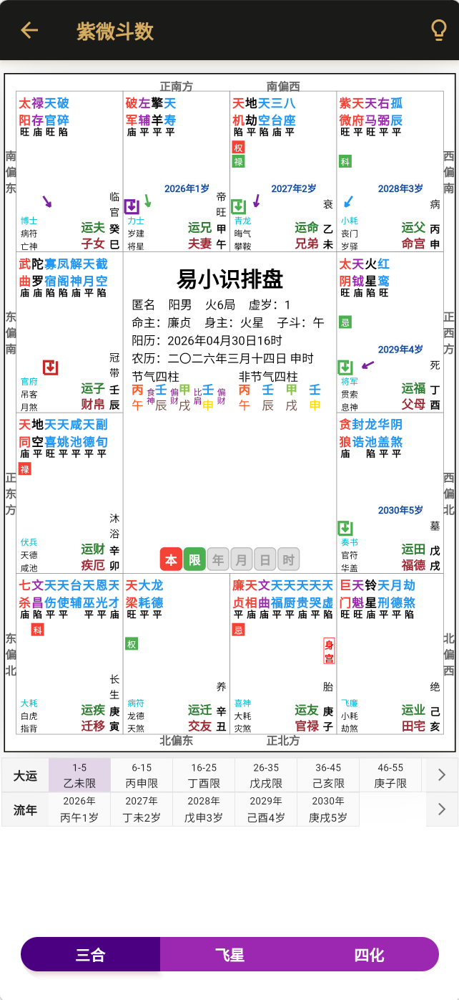
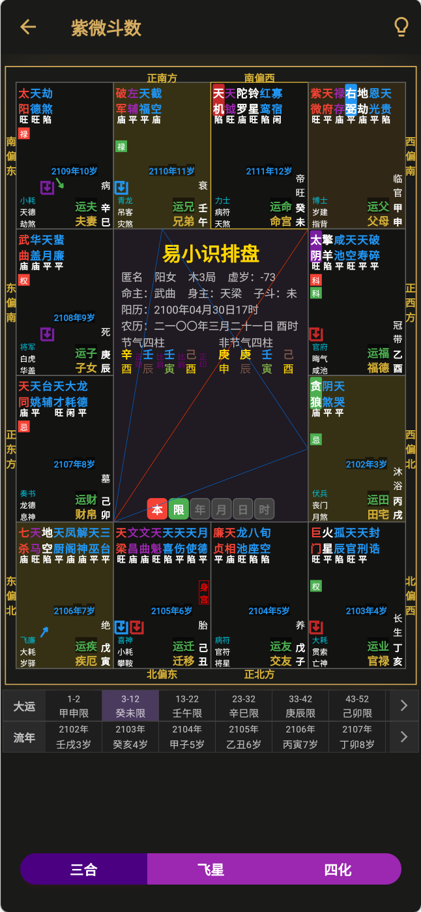

# 紫微斗数排盘系统

## 项目简介

紫微斗数，又称"紫微术"，是中国古代术数体系中的瑰宝，被命理界誉为"天下第一神数"。其推算命运是以人的农历出生年、月、日、时为基础，依固定公式排列命盘，分列十二宫位，并将诸星曜分列各宫位，用以推研人生造化。

本项目是一套完整的紫微斗数排盘系统，采用现代化的移动端界面设计，支持三合、飞星、四化等多种排盘方式。

## 功能展示

### 精美排盘界面

### 完整的十二宫位系统

## 核心功能

### 🎯 排盘功能
- 支持农历/公历日期转换
- 自动计算四柱八字
- 完整的十二宫位排布
- 命主、身主自动确定

### ✨ 星曜系统
- 十四主星完整排布
- 六吉星、六煞星齐全
- 辅星、杂星完整体系
- 庙旺平陷自动判断

### 🔄 四化飞星
- 化禄、化权、化科、化忌
- 大运流年自动排盘
- 流月流时推演
- 三方四正关系展示

### 📱 用户体验
- 现代化移动端设计
- 流畅的交互动画
- 多主题切换支持
- 便捷的操作界面

## 技术特点

- 完整的紫微斗数算法实现
- 支持三合派、飞星派等主流流派
- 精准的安星排盘算法
- 可扩展的架构设计

## 适用场景

- 命理研究机构
- 传统文化APP开发
- 个人命理学习工具
- 在线命理咨询平台

## 代码优势

✅ 算法精准 - 严格遵循传统紫微斗数理论
✅ 代码规范 - 结构清晰，易于维护
✅ 文档完善 - 详细的注释和开发文档
✅ 持续更新 - 提供技术支持和功能升级
✅ 商业授权 - 可用于商业项目开发

## 关于紫微斗数

紫微斗数将全部星曜分为北斗、南斗和中天三个系统。其中"斗"指南北二斗，"数"指吉凶祸福的气数。十二宫位包括：命宫、兄弟宫、夫妻宫、子女宫、财帛宫、疾厄宫、迁移宫、交友宫、官禄宫、田宅宫、福德宫、父母宫。

主流流派分为：
- **三合派**：主要通过对星曜的解读分析命运走向
- **四化派**：建立在对紫微星辰和飞星四化的解读基础之上

## 获取代码

本项目代码可用于商业用途，如需购买或咨询，请扫描下方微信二维码联系：

### 微信联系

### 联系方式

- 📱 微信：扫描上方二维码
- 💼 商业合作：提供完整源代码授权
- 📞 技术支持：购买后提供技术咨询服务

---

*注：紫微斗数是中国传统文化的一部分，仅供研究和参考，请勿过度迷信。*

